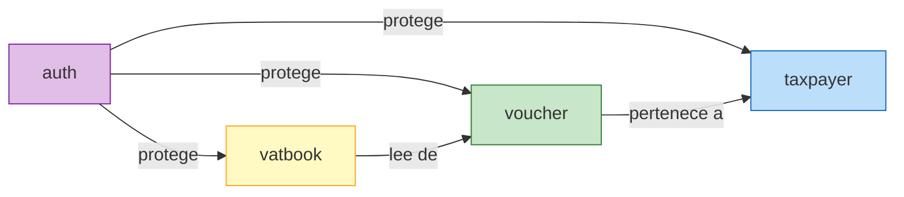
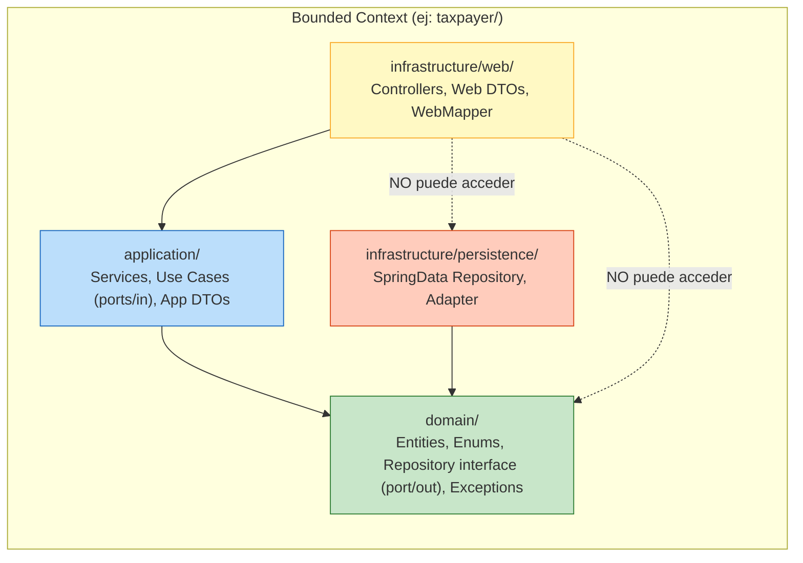
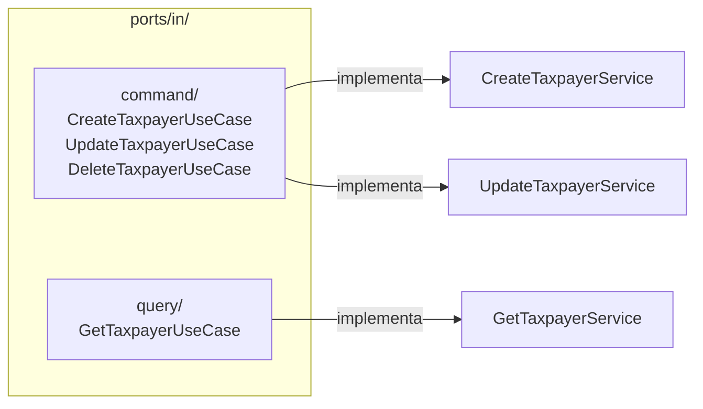
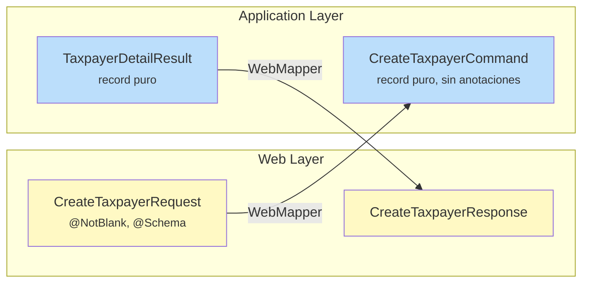
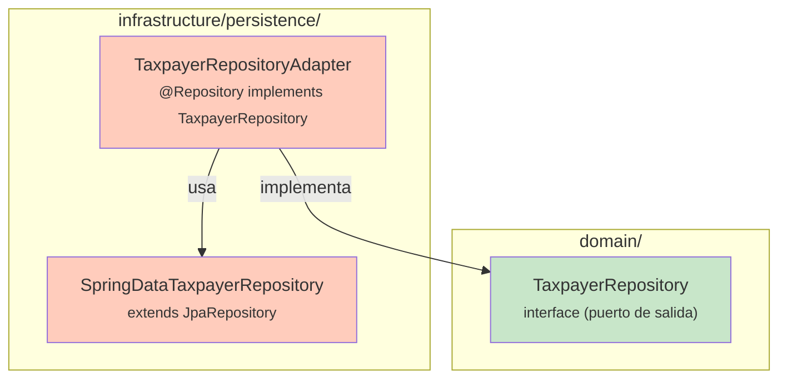
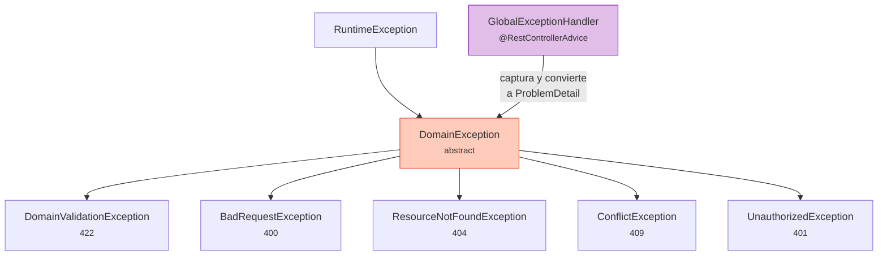
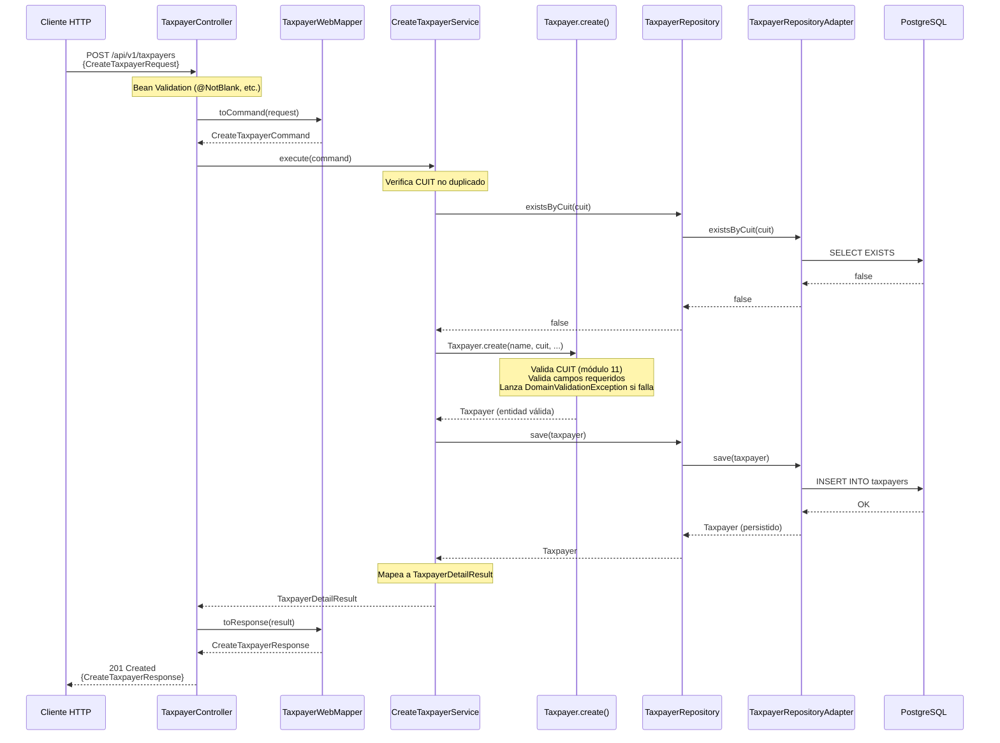
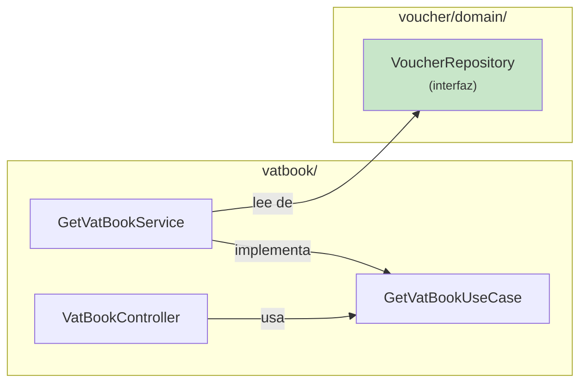
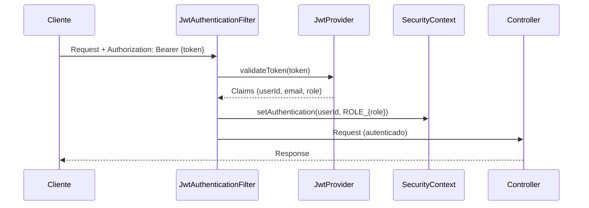

# Arquitectura — Tax Manager API

Este documento describe la arquitectura del proyecto, los patrones de diseño utilizados,
y cómo se organiza el código. Incluye diagramas para visualizar el flujo de datos y las
dependencias entre capas.

---

## Visión General

El proyecto sigue una **arquitectura hexagonal (Ports & Adapters)** pragmática,
organizada por **bounded contexts**. Cada módulo de negocio es un paquete independiente
con sus propias capas internas.

```
┌─────────────────────────────────────────────────────────┐
│                      APLICACIÓN                         │
│                                                         │
│   ┌─────────┐    ┌───────────┐    ┌──────────────────┐  │
│   │  auth/   │    │ taxpayer/ │    │    voucher/      │  │
│   └─────────┘    └───────────┘    └──────────────────┘  │
│                                                         │
│   ┌───────────┐    ┌────────────────────────────────┐   │
│   │  vatbook/ │    │           shared/               │   │
│   └───────────┘    └────────────────────────────────┘   │
└─────────────────────────────────────────────────────────┘
```

**¿Por qué hexagonal?**

- El **dominio** (reglas de negocio) no depende de frameworks, BD ni HTTP.
- Se puede testear el dominio y la lógica de aplicación sin levantar Spring ni PostgreSQL.
- Cambiar de PostgreSQL a otro motor, o de REST a GraphQL, no toca el dominio.
- Cada bounded context es independiente y puede evolucionar sin afectar a los demás.

**¿Por qué "pragmática"?**

- No usamos módulos Maven separados por bounded context (sería sobreingeniería para un MVP).
- La separación es por **paquetes**, no por módulos de compilación.
- No hay bus de eventos ni mediator — la comunicación entre contextos es directa
  vía interfaces de repositorio cuando es necesario (ej: vatbook lee de VoucherRepository).

---

## Bounded Contexts



| Bounded Context | Responsabilidad                          | Tipo          | Notas                                     |
|-----------------|------------------------------------------|---------------|-------------------------------------------|
| `auth`          | Autenticación y autorización             | CRUD + Auth   | JWT, roles, refresh tokens                |
| `taxpayer`      | Gestión de contribuyentes                | CRUD          | Validación CUIT, condición fiscal         |
| `voucher`       | Registro de comprobantes fiscales        | CRUD          | Validación de montos, tipos               |
| `vatbook`       | Generación de libros IVA                 | Query-only    | Sin entidad propia, consume VoucherRepository |

---

## Capas dentro de cada Bounded Context

Cada bounded context tiene 3 capas con una regla de dependencia estricta:



### Regla de dependencia

| Capa               | Puede depender de       | NO puede depender de                |
|---------------------|-------------------------|--------------------------------------|
| `domain`           | Nada (solo Java puro)   | application, infrastructure, Spring  |
| `application`      | `domain`                | infrastructure, Spring (excepto `@Service`) |
| `infrastructure`   | `domain`, `application` | —                                    |

> **La capa web NO accede directamente al dominio.** Siempre pasa por application.
> La capa de persistencia implementa las interfaces definidas en domain.

---

## Estructura de Paquetes

```
src/main/java/com/{group}/taxmanagerapi/
├── TaxManagerApiApplication.java
│
├── taxpayer/                              ← Bounded Context
│   ├── domain/
│   │   ├── entity/
│   │   │   └── Taxpayer.java              ← Always Valid Domain Entity
│   │   ├── enums/
│   │   │   └── TaxCondition.java
│   │   ├── repository/
│   │   │   └── TaxpayerRepository.java    ← Puerto de SALIDA (interfaz)
│   │   └── exception/
│   │       └── InvalidTaxpayerException.java
│   │
│   ├── application/
│   │   ├── ports/in/
│   │   │   ├── command/
│   │   │   │   ├── CreateTaxpayerUseCase.java    ← Puerto de ENTRADA
│   │   │   │   ├── UpdateTaxpayerUseCase.java
│   │   │   │   └── DeleteTaxpayerUseCase.java
│   │   │   └── query/
│   │   │       └── GetTaxpayerUseCase.java
│   │   ├── dto/
│   │   │   ├── CreateTaxpayerCommand.java        ← record (input)
│   │   │   ├── UpdateTaxpayerCommand.java
│   │   │   ├── TaxpayerItemResult.java           ← record (output lista)
│   │   │   └── TaxpayerDetailResult.java         ← record (output detalle)
│   │   └── service/
│   │       ├── CreateTaxpayerService.java        ← @Service implements UseCase
│   │       ├── UpdateTaxpayerService.java
│   │       ├── DeleteTaxpayerService.java
│   │       └── GetTaxpayerService.java
│   │
│   └── infrastructure/
│       ├── persistence/
│       │   ├── SpringDataTaxpayerRepository.java ← extends JpaRepository
│       │   └── adapter/
│       │       └── TaxpayerRepositoryAdapter.java ← @Repository implements TaxpayerRepository
│       └── web/
│           ├── controller/
│           │   └── TaxpayerController.java
│           ├── dto/
│           │   ├── CreateTaxpayerRequest.java    ← record + @NotBlank + @Schema
│           │   ├── CreateTaxpayerResponse.java
│           │   ├── UpdateTaxpayerRequest.java
│           │   ├── TaxpayerListResponse.java     ← record (item para listados)
│           │   └── TaxpayerDetailResponse.java
│           └── mapper/
│               └── TaxpayerWebMapper.java        ← @Component
│
├── voucher/                               ← Mismo patrón
│   ├── domain/
│   ├── application/
│   └── infrastructure/
│
├── vatbook/                               ← Query-only (sin domain/entity)
│   ├── application/
│   │   ├── ports/in/query/
│   │   │   └── GetVatBookUseCase.java
│   │   ├── dto/
│   │   │   └── VatBookResult.java
│   │   └── service/
│   │       └── GetVatBookService.java     ← Usa VoucherRepository directamente
│   └── infrastructure/web/
│       ├── controller/
│       │   └── VatBookController.java
│       ├── dto/
│       │   └── VatBookResponse.java
│       └── mapper/
│           └── VatBookWebMapper.java
│
├── auth/                                  ← Mismo patrón base
│   ├── domain/
│   ├── application/
│   └── infrastructure/
│
└── shared/                                ← Código transversal
    ├── config/
    │   └── OpenApiConfig.java
    ├── exception/
    │   ├── DomainException.java           ← abstract base
    │   ├── DomainValidationException.java
    │   ├── BadRequestException.java
    │   ├── ResourceNotFoundException.java
    │   ├── ConflictException.java
    │   ├── UnauthorizedException.java
    │   └── GlobalExceptionHandler.java    ← @RestControllerAdvice
    ├── security/
    │   ├── SecurityConfig.java
    │   ├── JwtProvider.java
    │   ├── JwtAuthenticationFilter.java
    │   ├── CustomAuthenticationEntryPoint.java
    │   └── CustomAccessDeniedHandler.java
    └── fiscal/
        └── CuitValidator.java
```

---

## Patrones de Diseño

### 1. Always Valid Domain

Las entidades de dominio **siempre están en un estado válido**. No se pueden construir
con datos inválidos.

```
┌─────────────────────────────────────────────────┐
│ Taxpayer (entidad de dominio)                    │
├─────────────────────────────────────────────────┤
│ - Constructor PRIVADO                            │
│ - Factory method estático: create(...)           │
│ - Validaciones en create() y en métodos          │
│ - Sin setters públicos                           │
│ - Mutación solo vía métodos de comportamiento    │
│ - Lanza DomainValidationException si falla       │
│ - Lombok solo para JPA: @Getter, @NoArgsConstructor │
├─────────────────────────────────────────────────┤
│ + static create(name, cuit, ...) → Taxpayer      │
│ + updateInfo(name, cuit, ...) → void             │
│ + deactivate() → void                            │
│ + getId() → UUID                                 │
│ + getBusinessName() → String                     │
│ + ...                                            │
└─────────────────────────────────────────────────┘
```

**Ejemplo conceptual:**

```java
// ✅ Correcto — creación vía factory method
Taxpayer taxpayer = Taxpayer.create("López S.R.L.", "20123456783",
    TaxCondition.RESPONSABLE_INSCRIPTO, "Av. Corrientes 1234", null, null);

// ❌ Imposible — constructor privado
Taxpayer taxpayer = new Taxpayer();
taxpayer.setBusinessName(""); // No existen setters
```

### 2. CQRS Lite

Los puertos de entrada (use cases) se separan en **commands** (escritura) y **queries**
(lectura). No es CQRS completo (misma BD, mismo modelo), pero mejora la organización.



Cada use case es una **interfaz con un solo método** (o pocos relacionados):

```java
// Command — una acción de escritura
public interface CreateTaxpayerUseCase {
    TaxpayerDetailResult execute(CreateTaxpayerCommand command);
}

// Query — lectura, puede tener varios métodos
public interface GetTaxpayerUseCase {
    Page<TaxpayerItemResult> findAll(Pageable pageable);
    TaxpayerDetailResult findById(UUID id);
    TaxpayerDetailResult findByCuit(String cuit);
}
```

### 3. DTO Separation por Capa

Hay **dos sets de DTOs** para evitar que las anotaciones web contaminen la capa de
aplicación:



| Capa          | DTOs                        | Anotaciones                   | Responsabilidad           |
|---------------|-----------------------------|-------------------------------|---------------------------|
| Web           | `*Request`, `*Response`     | Bean Validation + Swagger     | Validación de formato, documentación API |
| Application   | `*Command`, `*Result`       | Ninguna                       | Contrato entre capas      |

**El `WebMapper`** (un `@Component`, no MapStruct) traduce entre ambos sets:

```java
@Component
public class TaxpayerWebMapper {
    public CreateTaxpayerCommand toCommand(CreateTaxpayerRequest request) { ... }
    public CreateTaxpayerResponse toResponse(TaxpayerDetailResult result) { ... }
}
```

> **¿Por qué no MapStruct para el WebMapper?** MapStruct es ideal para mapeos
> entity↔DTO que son repetitivos. Los WebMappers tienen lógica específica (formatear
> CUIT, etc.) y son pocos métodos — un `@Component` manual es más claro.
> MapStruct se usa en el RepositoryAdapter si el mapeo entity↔domain lo justifica.

### 4. Persistence Adapter

La capa de dominio define una **interfaz** (puerto de salida) que describe qué
operaciones de persistencia necesita, sin saber nada de JPA ni Spring Data:



```java
// Puerto de salida (domain) — no sabe de JPA
public interface TaxpayerRepository {
    Taxpayer save(Taxpayer taxpayer);
    Optional<Taxpayer> findById(UUID id);
    Optional<Taxpayer> findByCuit(String cuit);
    Page<Taxpayer> findAllActive(Pageable pageable);
    boolean existsByCuit(String cuit);
}

// Adapter (infrastructure) — implementa con Spring Data
@Repository
public class TaxpayerRepositoryAdapter implements TaxpayerRepository {
    private final SpringDataTaxpayerRepository jpaRepository;
    // delega al JpaRepository
}
```

> **Nota:** En este proyecto, las entidades JPA **son** las entidades de dominio
> (misma clase con `@Entity` + Lombok). Esto es una decisión pragmática: no
> duplicamos entidades porque el mapeo 1:1 no lo justifica en un MVP. Si en el
> futuro el modelo de dominio diverge del modelo de persistencia, se separan.

### 5. Jerarquía de Excepciones con RFC 7807



Cada excepción lleva un código HTTP y un mensaje descriptivo. El `GlobalExceptionHandler`
las intercepta y las convierte al formato `ProblemDetail` de Spring 6+ (RFC 7807).

---

## Flujo de una Request (ejemplo completo)

Crear un contribuyente: `POST /api/v1/taxpayers`



### Resumen del flujo

| Paso | Componente                   | Acción                                              |
|------|------------------------------|------------------------------------------------------|
| 1    | `TaxpayerController`         | Recibe request, Bean Validation automática           |
| 2    | `TaxpayerWebMapper`          | Convierte Request → Command                          |
| 3    | `CreateTaxpayerService`      | Verifica reglas de aplicación (CUIT único)           |
| 4    | `Taxpayer.create()`          | Valida reglas de dominio, crea entidad válida        |
| 5    | `TaxpayerRepositoryAdapter`  | Persiste la entidad vía Spring Data JPA              |
| 6    | `CreateTaxpayerService`      | Mapea entidad → Result                               |
| 7    | `TaxpayerWebMapper`          | Convierte Result → Response                          |
| 8    | `TaxpayerController`         | Devuelve 201 Created con el response                 |

---

## Módulo Shared

El paquete `shared/` contiene código transversal que usan todos los bounded contexts:

| Paquete              | Contenido                      | Notas                                    |
|----------------------|--------------------------------|------------------------------------------|
| `shared/config`      | `OpenApiConfig`                | Configuración de Swagger/SpringDoc       |
| `shared/exception`   | Jerarquía de excepciones + handler | DomainException, GlobalExceptionHandler |
| `shared/security`    | JWT, filtro, config de seguridad | SecurityConfig, JwtProvider, JwtAuthenticationFilter |
| `shared/fiscal`      | Validadores fiscales argentinos | CuitValidator (módulo 11)               |

> `shared/` **no es un bounded context**. No tiene domain/application/infrastructure.
> Es simplemente código de soporte que no pertenece a ningún contexto específico.

---

## Módulo VatBook (Query-Only)

`vatbook/` es un caso especial: **no tiene entidad de dominio propia** ni commands.
Genera reportes a partir de los vouchers existentes.



**¿Por qué consume `VoucherRepository` directamente?**

- No hay lógica de escritura — solo consultas con filtros de período y categoría.
- Crear un "VatBookRepository" sería una abstracción vacía sobre las mismas queries.
- Si en el futuro se cachean los libros IVA, se puede agregar una entidad sin romper nada.

---

## Seguridad (JWT)



| Componente                        | Responsabilidad                                    |
|-----------------------------------|----------------------------------------------------|
| `SecurityConfig`                  | Configura rutas públicas/protegidas, CSRF, filtro JWT |
| `JwtProvider`                     | Genera y valida tokens JWT (HS256, claims: sub/email/role) |
| `JwtAuthenticationFilter`         | Intercepta cada request, extrae y valida el JWT    |
| `CustomAuthenticationEntryPoint`  | Responde 401 en formato ProblemDetail              |
| `CustomAccessDeniedHandler`       | Responde 403 en formato ProblemDetail              |

**Configuración de tokens:**

| Token          | Duración       | Tipo          | Almacenamiento             |
|----------------|----------------|---------------|----------------------------|
| Access Token   | 15 minutos     | JWT (HS256)   | Solo en cliente (memory)   |
| Refresh Token  | 7 días         | UUID opaco    | Base de datos (`refresh_tokens`) |

---

## Testing Strategy

```
┌─────────────────────────────────────────────┐
│            Pirámide de Tests                 │
│                                              │
│              ┌─────────┐                     │
│              │  E2E    │ ← Testcontainers    │
│              │  Tests  │   (pocos, lentos)   │
│            ┌─┴─────────┴─┐                   │
│            │ Integration  │ ← @WebMvcTest,   │
│            │    Tests     │   @DataJpaTest   │
│          ┌─┴─────────────┴─┐                 │
│          │   Unit Tests     │ ← Mockito      │
│          │   (mayoría)      │   (rápidos)    │
│          └─────────────────┘                 │
└─────────────────────────────────────────────┘
```

| Nivel        | Qué testea                           | Herramientas                        | Dónde              |
|--------------|--------------------------------------|-------------------------------------|--------------------|
| Unit         | Entidades de dominio, services       | JUnit 5 + Mockito                   | `src/test/java`    |
| Integration  | Controllers, repositories            | @WebMvcTest, @DataJpaTest           | `src/test/java`    |
| E2E          | Flujo completo HTTP → DB → HTTP      | Testcontainers (PostgreSQL) + RestAssured | `src/test/java` |

**Prioridad de testing:**

1. Entidades de dominio (validaciones, factory methods) → Unit tests exhaustivos
2. Services (lógica de aplicación) → Unit tests con mocks de repositorio
3. Controllers → @WebMvcTest (sin BD real)
4. Flujos críticos completos → E2E con Testcontainers

---

## Decisiones Arquitectónicas

Las decisiones clave están documentadas como ADRs (Architecture Decision Records)
en [docs/adr/](./adr/). Resumen:

| ADR | Decisión                                       | Notas                                        |
|-----|------------------------------------------------|----------------------------------------------|
| 001 | Arquitectura hexagonal por paquetes            | Sin módulos Maven separados                  |
| 002 | Always Valid Domain con factory methods        | Constructor privado, sin setters             |
| 003 | DTOs separados por capa (Web vs Application)   | WebMapper manual, no MapStruct              |
| 004 | JWT stateless con refresh token en BD          | Refresh token rotation en refresh endpoint   |
| 005 | Entidad JPA = Entidad de dominio               | Decisión pragmática, separable a futuro      |
| 006 | UUID como identificador de entidades           | gen_random_uuid() en PostgreSQL              |

Ver cada ADR para contexto completo, alternativas consideradas y consecuencias.
