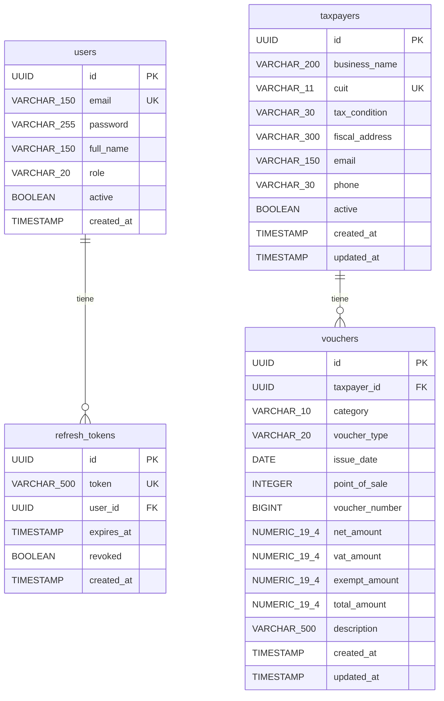

# Modelo de Datos — Tax Manager API

Este documento describe el modelo de datos relacional del proyecto: tablas, columnas,
tipos, constraints, índices y relaciones. Es la fuente de verdad para las migraciones
Flyway y las entidades JPA.

> **Referencia:** Ver [DOMAIN_GLOSSARY.md](./DOMAIN_GLOSSARY.md) para el mapeo completo
> entre términos fiscales argentinos y nombres en código.

---

## Diagrama Entidad-Relación



---

## Tablas

### `users`

Usuarios del sistema (contadores que operan la aplicación).

| Columna      | Tipo            | Nullable | Default | Constraint          | Notas                              |
|--------------|-----------------|----------|---------|---------------------|------------------------------------|
| `id`         | `UUID`          | NO       | `gen_random_uuid()` | PK       | Generado por PostgreSQL            |
| `email`      | `VARCHAR(150)`  | NO       | —       | UNIQUE              | Usado como username para login     |
| `password`   | `VARCHAR(255)`  | NO       | —       | —                   | Hash BCrypt                        |
| `full_name`  | `VARCHAR(150)`  | NO       | —       | —                   | Nombre para mostrar                |
| `role`       | `VARCHAR(20)`   | NO       | —       | CHECK (valor válido) | `ADMIN`, `ACCOUNTANT`, `VIEWER`   |
| `active`     | `BOOLEAN`       | NO       | `true`  | —                   | Soft delete                        |
| `created_at` | `TIMESTAMP`     | NO       | `now()` | —                   | Fecha de creación                  |

**Índices:**

| Nombre           | Columnas | Tipo   | Notas                           |
|------------------|----------|--------|---------------------------------|
| `pk_users`       | `id`     | PK     | —                               |
| `uk_users_email` | `email`  | UNIQUE | Login por email                 |

---

### `refresh_tokens`

Tokens de refresco para renovar access tokens JWT. Se almacenan para poder revocarlos
en logout.

| Columna      | Tipo            | Nullable | Default | Constraint          | Notas                              |
|--------------|-----------------|----------|---------|---------------------|------------------------------------|
| `id`         | `UUID`          | NO       | `gen_random_uuid()` | PK       | —                                  |
| `token`      | `VARCHAR(500)`  | NO       | —       | UNIQUE              | Valor del refresh token            |
| `user_id`    | `UUID`          | NO       | —       | FK → `users.id`     | Usuario dueño del token            |
| `expires_at` | `TIMESTAMP`     | NO       | —       | —                   | Fecha/hora de expiración           |
| `revoked`    | `BOOLEAN`       | NO       | `false` | —                   | `true` cuando se hace logout       |
| `created_at` | `TIMESTAMP`     | NO       | `now()` | —                   | Fecha de creación                  |

**Índices:**

| Nombre                        | Columnas  | Tipo   | Notas                           |
|-------------------------------|-----------|--------|---------------------------------|
| `pk_refresh_tokens`           | `id`      | PK     | —                               |
| `uk_refresh_tokens_token`     | `token`   | UNIQUE | Búsqueda por token en refresh   |
| `idx_refresh_tokens_user_id`  | `user_id` | INDEX  | Buscar tokens de un usuario     |

**Foreign Keys:**

| Nombre                       | Columna   | Referencia    | On Delete | Notas                          |
|------------------------------|-----------|---------------|-----------|--------------------------------|
| `fk_refresh_tokens_user_id`  | `user_id` | `users.id`    | CASCADE   | Si se borra el user, se borran sus tokens |

---

### `taxpayers`

Contribuyentes (clientes del contador). Representan personas físicas o jurídicas
inscriptas ante AFIP.

| Columna          | Tipo            | Nullable | Default | Constraint          | Notas                              |
|------------------|-----------------|----------|---------|---------------------|------------------------------------|
| `id`             | `UUID`          | NO       | `gen_random_uuid()` | PK       | —                                  |
| `business_name`  | `VARCHAR(200)`  | NO       | —       | —                   | Razón social o nombre              |
| `cuit`           | `VARCHAR(11)`   | NO       | —       | UNIQUE              | Sin guiones, ej: `20123456783`     |
| `tax_condition`  | `VARCHAR(30)`   | NO       | —       | CHECK (valor válido) | Enum: ver glosario                |
| `fiscal_address` | `VARCHAR(300)`  | NO       | —       | —                   | Domicilio fiscal completo          |
| `email`          | `VARCHAR(150)`  | SI       | —       | —                   | Email de contacto (opcional)       |
| `phone`          | `VARCHAR(30)`   | SI       | —       | —                   | Teléfono (opcional)                |
| `active`         | `BOOLEAN`       | NO       | `true`  | —                   | Soft delete                        |
| `created_at`     | `TIMESTAMP`     | NO       | `now()` | —                   | Auditoría                          |
| `updated_at`     | `TIMESTAMP`     | NO       | `now()` | —                   | Auditoría                          |

**Índices:**

| Nombre                         | Columnas        | Tipo   | Notas                                 |
|--------------------------------|-----------------|--------|---------------------------------------|
| `pk_taxpayers`                 | `id`            | PK     | —                                     |
| `uk_taxpayers_cuit`            | `cuit`          | UNIQUE | Búsqueda directa por CUIT             |
| `idx_taxpayers_business_name`  | `business_name` | INDEX  | Búsqueda parcial por razón social     |
| `idx_taxpayers_active`         | `active`        | INDEX  | Filtrar contribuyentes activos        |

---

### `vouchers`

Comprobantes fiscales de compra y venta. Cada comprobante pertenece a un contribuyente.

| Columna          | Tipo            | Nullable | Default | Constraint          | Notas                                    |
|------------------|-----------------|----------|---------|---------------------|------------------------------------------|
| `id`             | `UUID`          | NO       | `gen_random_uuid()` | PK       | —                                        |
| `taxpayer_id`    | `UUID`          | NO       | —       | FK → `taxpayers.id` | Contribuyente dueño del comprobante      |
| `category`       | `VARCHAR(10)`   | NO       | —       | CHECK (valor válido) | `PURCHASE` o `SALE`                     |
| `voucher_type`   | `VARCHAR(20)`   | NO       | —       | CHECK (valor válido) | `FACTURA_A`, `NOTA_CREDITO_B`, etc.     |
| `issue_date`     | `DATE`          | NO       | —       | —                   | Fecha de emisión del comprobante         |
| `point_of_sale`  | `INTEGER`       | NO       | —       | CHECK (1-99999)     | Punto de venta de emisión                |
| `voucher_number` | `BIGINT`        | NO       | —       | CHECK (> 0)         | Número secuencial                        |
| `net_amount`     | `NUMERIC(19,4)` | NO       | —       | CHECK (>= 0)        | Neto gravado (base imponible)            |
| `vat_amount`     | `NUMERIC(19,4)` | NO       | —       | CHECK (>= 0)        | Monto de IVA                             |
| `exempt_amount`  | `NUMERIC(19,4)` | NO       | —       | CHECK (>= 0)        | Monto exento de IVA                      |
| `total_amount`   | `NUMERIC(19,4)` | NO       | —       | CHECK (> 0)         | Total = net + vat + exempt               |
| `description`    | `VARCHAR(500)`  | SI       | —       | —                   | Nota u observación (opcional)            |
| `created_at`     | `TIMESTAMP`     | NO       | `now()` | —                   | Auditoría                                |
| `updated_at`     | `TIMESTAMP`     | NO       | `now()` | —                   | Auditoría                                |

**Índices:**

| Nombre                              | Columnas                    | Tipo   | Notas                                        |
|-------------------------------------|-----------------------------|--------|----------------------------------------------|
| `pk_vouchers`                       | `id`                        | PK     | —                                            |
| `idx_vouchers_taxpayer_id`          | `taxpayer_id`               | INDEX  | Listar comprobantes de un contribuyente      |
| `idx_vouchers_category_issue_date`  | `category`, `issue_date`    | INDEX  | Libros IVA: filtro por tipo y período        |
| `idx_vouchers_issue_date`           | `issue_date`                | INDEX  | Ordenamiento cronológico                     |

**Foreign Keys:**

| Nombre                       | Columna       | Referencia       | On Delete  | Notas                                      |
|------------------------------|---------------|------------------|------------|--------------------------------------------|
| `fk_vouchers_taxpayer_id`    | `taxpayer_id` | `taxpayers.id`   | RESTRICT   | No se puede borrar un contribuyente con comprobantes |

> **Nota sobre On Delete:** Se usa `RESTRICT` en la FK de vouchers → taxpayers porque
> borrar un contribuyente que tiene comprobantes sería una pérdida de datos fiscales.
> El soft delete (`active = false`) es la forma correcta de "desactivar" un contribuyente.

---

## Constraints de Negocio

Estas validaciones se implementan tanto a nivel de base de datos (CHECK constraints)
como a nivel de dominio (entidad Java):

### Contribuyente (`taxpayers`)

| Regla                                         | Implementación DB                            | Implementación Java          |
|-----------------------------------------------|----------------------------------------------|------------------------------|
| CUIT debe tener 11 dígitos                    | `CHECK (LENGTH(cuit) = 11)`                  | `CuitValidator`              |
| CUIT debe ser único                           | `UNIQUE (cuit)`                              | `ConflictException`          |
| Condición fiscal válida                       | `CHECK (tax_condition IN (...))`             | `TaxCondition` enum          |
| Razón social no puede estar vacía             | `NOT NULL`                                   | `@NotBlank` + dominio        |
| Domicilio fiscal no puede estar vacío         | `NOT NULL`                                   | Validación en `create()`     |

### Comprobante (`vouchers`)

| Regla                                         | Implementación DB                            | Implementación Java          |
|-----------------------------------------------|----------------------------------------------|------------------------------|
| Montos no pueden ser negativos                | `CHECK (net_amount >= 0)`, etc.              | Validación en `create()`     |
| Total debe ser > 0                            | `CHECK (total_amount > 0)`                   | Validación en `create()`     |
| net + vat + exempt = total                    | —                                            | Validación en `create()`     |
| Punto de venta entre 1 y 99999               | `CHECK (point_of_sale BETWEEN 1 AND 99999)` | Validación en `create()`     |
| Número de comprobante > 0                     | `CHECK (voucher_number > 0)`                 | Validación en `create()`     |
| Categoría válida                              | `CHECK (category IN ('PURCHASE', 'SALE'))`   | `VoucherCategory` enum       |
| Tipo de comprobante válido                    | `CHECK (voucher_type IN (...))`              | `VoucherType` enum           |
| Contribuyente debe existir                    | FK `taxpayer_id`                             | `ResourceNotFoundException`  |

> **Nota:** La regla `net + vat + exempt = total` **no se implementa como CHECK en DB**
> porque NUMERIC con 4 decimales puede generar diferencias de redondeo en la comparación.
> Se valida exclusivamente en la capa de dominio Java con `BigDecimal.compareTo()`.

---

## Migraciones Flyway

Las migraciones siguen la convención de Flyway y se organizan así:

```
src/main/resources/db/migration/
├── V1__create_users_table.sql
├── V2__create_refresh_tokens_table.sql
├── V3__create_taxpayers_table.sql
└── V4__create_vouchers_table.sql
```

**Convención de nombres:** `V{número}__{descripcion_snake_case}.sql`

Cada migración crea la tabla con todas sus columnas, constraints, índices y foreign keys.
Las migraciones son **inmutables** una vez aplicadas — las modificaciones se hacen con
migraciones nuevas.

---

## Estrategia de IDs

- **Tipo:** `UUID` (v4, random)
- **Generación:** En PostgreSQL con `gen_random_uuid()` como default
- **En Java:** `UUID.randomUUID()` en el factory method `create()` de cada entidad
- **Motivo:** Evita colisiones en entornos distribuidos, no expone información secuencial,
  y es el estándar moderno para APIs REST.

---

## Auditoría

Todas las tablas incluyen campos de auditoría:

| Campo        | Tipo        | Descripción                          | Implementación JPA              |
|--------------|-------------|--------------------------------------|---------------------------------|
| `created_at` | `TIMESTAMP` | Fecha/hora de creación del registro  | `@CreationTimestamp` (Hibernate)|
| `updated_at` | `TIMESTAMP` | Fecha/hora de última modificación    | `@UpdateTimestamp` (Hibernate)  |

> `users` y `refresh_tokens` solo tienen `created_at` porque no se actualizan
> (el refresh token se revoca, no se edita).

---

## Soft Delete

Las tablas `users` y `taxpayers` usan **soft delete** con un campo `active`:

- `active = true` → Registro visible y operativo
- `active = false` → Registro "eliminado" lógicamente

**Implicaciones:**
- Los endpoints `DELETE` cambian `active` a `false` (no ejecutan `DELETE` SQL)
- Los listados filtran por `active = true` por defecto
- Las búsquedas por CUIT/email solo consideran registros activos
- Los comprobantes (`vouchers`) **no tienen soft delete** — un comprobante fiscal
  no se puede eliminar (tiene valor legal)
